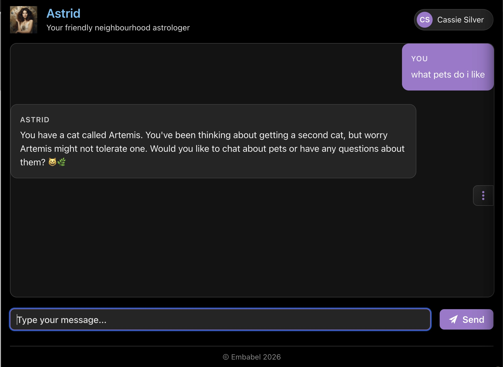
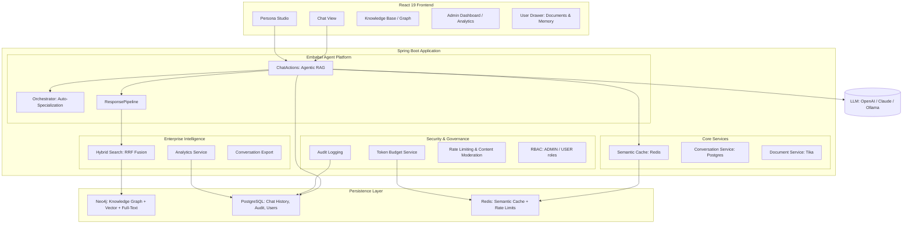
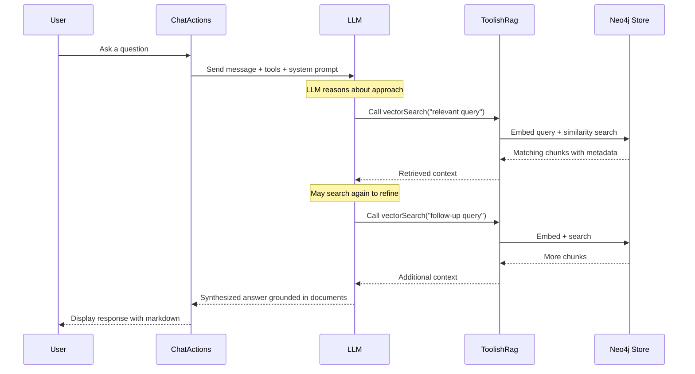
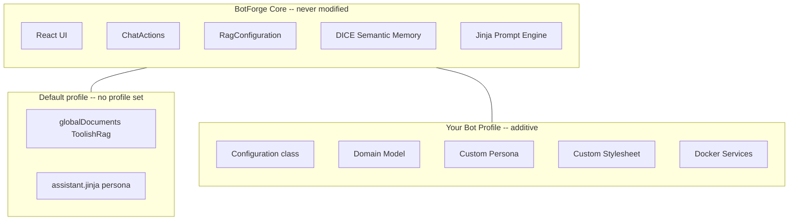
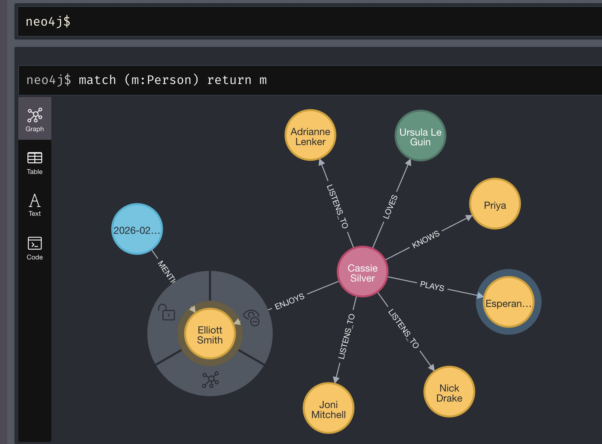

&nbsp;&nbsp;&nbsp;&nbsp;

# BotForge

> **Template repository** -- Use this as a starting point for building your own RAG chatbot with the [Embabel Agent Framework](https://embabel.com). Click **"Use this template"** on GitHub to create your own copy.

**A RAG-powered document chatbot with a modern React 19 interface, built on the [Embabel Agent Framework](https://github.com/embabel/embabel-agent).**

Upload documents, ask questions, and get intelligent answers grounded in your content -- powered by agentic Retrieval-Augmented Generation with Neo4j graph-backed vector search, [DICE](https://github.com/embabel/dice) semantic memory, and a built-in **Persona Studio** for forging custom AI identities.

BotForge is designed to be **extended without modification**. The core application provides the full RAG infrastructure, React UI, memory system, and chat plumbing out of the box. To build your own chatbot, you add a [Spring profile](https://docs.spring.io/spring-boot/reference/features/profiles.html) with your persona, domain model, tools, and styling -- all in a separate package, without touching any existing code.

<p align="center">
  
  <br>
  <em>The architext chatbot (running on the <a href="https://github.com/embabel/urbot/tree/architext">architext branch</a>) recalls facts learned from uploaded files and conversation, stored as typed entities in the knowledge graph.</em>
</p>

---

## Architecture



## How Agentic RAG Works

Unlike traditional RAG pipelines where retrieval is a fixed preprocessing step, BotForge uses the **Embabel Agent Framework's Utility AI pattern** to make retrieval _agentic_. The LLM autonomously decides when and how to search your documents.



Key aspects of the agentic approach:

- **Autonomous tool use** -- The LLM decides _whether_ to search and _what_ to search for
- **Iterative retrieval** -- Multiple searches can refine results before answering
- **Context-aware filtering** -- Results are scoped to the user's current workspace context
- **Template-driven prompts** -- Jinja2 templates separate persona, objective, and guardrails

## Document Contexts and Memory

BotForge has two document scopes for RAG and a separate memory system for learning facts about users.

### Document Ingestion

| Scope | Access | Ingestion | Description |
|---|---|---|---|
| **Personal** | Per-user context | User Drawer (click profile) | Documents scoped to a user's named context (e.g. `2_personal`). Users can create and switch between multiple contexts. |
| **Global** | Shared across all users | Global Drawer (`...` toggle) | Documents available to everyone, stored under the `global` context. |

RAG search filters results to the user's current effective context, so personal and global documents are searched independently based on which context is active. See [`DocumentService`](src/main/java/org/legendstack/basebot/rag/DocumentService.java) for the ingestion implementation and [`RagConfiguration`](src/main/java/org/legendstack/basebot/rag/RagConfiguration.java) for the store setup.

### Memory: Learning Facts with "Learn"

The **Learn** button in the Memory tab lets users upload files (PDF, DOCX, TXT, etc.) to extract structured facts about themselves. Unlike document ingestion for RAG (which chunks and embeds documents for search), Learn runs the [DICE](https://github.com/embabel/dice) proposition extraction pipeline:

1. **Parse** -- Tika extracts text from the uploaded file
2. **Extract** -- The LLM identifies propositions (factual claims) from the text
3. **Resolve** -- Mentions in propositions are resolved to named entities in the knowledge graph
4. **Project** -- Semantic relationships between entities are extracted and stored as graph edges

This creates a rich knowledge graph of facts about the user. For example, uploading a bio might extract "Alice lives in Hobart", "Alice owns a cat named Artemis", "Alice likes Big Thief" -- each linked to typed entities (`Place`, `Pet`, `Band`) in Neo4j.

The same pipeline also runs incrementally on conversation messages: every few turns, [DICE](https://github.com/embabel/dice) extracts propositions from the chat window, so the bot progressively learns about the user through natural conversation.

See [`IncrementalPropositionExtraction`](src/main/java/org/legendstack/basebot/proposition/extraction/IncrementalPropositionExtraction.java) for the extraction flow and [`PropositionConfiguration`](src/main/java/org/legendstack/basebot/proposition/PropositionConfiguration.java) for the pipeline wiring.

<p align="center">
  
  <br>
  <em>The Memory tab in the User Drawer showing 68 propositions extracted from uploaded files and conversation, clustered by topic. Each cluster groups related facts -- here about Cassie's pet Artemis, her gardening, cooking, and podcast habits.</em>
</p>

**Entity extraction requires domain model interfaces.** Without `NamedEntity` subinterfaces (like `Pet`, `Place`, `Band`), DICE has no schema to guide extraction and will only extract untyped propositions. See [Domain Model](#3-domain-model-namedentity-interfaces) below.

## Technology Stack

| Layer | Technology | Role |
|---|---|---|
| **Frontend** | [React 19](https://react.dev/) | Modern UI with glassmorphism, dark mode, responsive design |
| **Backend** | [Spring Boot 3.5](https://spring.io/projects/spring-boot) | Application framework (Java 25) |
| **Agent Framework** | [Embabel Agent](https://github.com/embabel/embabel-agent) | Agentic AI orchestration & Utility AI pattern |
| **Semantic Memory** | [DICE](https://github.com/embabel/dice) | Fact extraction & knowledge graph projection |
| **Vector + Graph Store** | [Neo4j](https://neo4j.com/) | Vector embeddings, full-text indexing, knowledge graph |
| **Relational Store** | [PostgreSQL](https://www.postgresql.org/) | Chat history, audit logs, user accounts, personas |
| **Cache + Rate Limiting** | [Redis](https://redis.io/) | Semantic cache, token budgets, rate limit counters |
| **Document Parsing** | [Apache Tika](https://tika.apache.org/) | Extract text from 1000+ file formats |
| **Search** | Hybrid (Vector + Keyword) | Reciprocal Rank Fusion combining cosine similarity and Lucene full-text |
| **LLM** | OpenAI / Anthropic / Ollama | Multi-provider support for reasoning and embeddings |

### Embabel Agent Framework

BotForge is built on the [Embabel Agent Framework](https://github.com/embabel/embabel-agent), which provides:

- **`AgentProcessChatbot`** -- Wires actions into a conversational agent using the Utility AI pattern, where the LLM autonomously selects which `@Action` methods to invoke
- **`ToolishRag`** -- Exposes vector search as an LLM-callable tool, enabling agentic retrieval
- **`DrivineStore`** -- Neo4j-backed RAG store with vector indexes and graph relationships (Lucene and pgvector backends are also available)
- **Jinja2 prompt templates** -- Composable system prompts with persona/objective/guardrails separation

### React Frontend

The frontend is built with React 19 and TypeScript, served via Vite 6:

- `ChatPage.tsx` -- Main chat interface with message bubbles, markdown rendering, conversation search & export
- `StudioPage.tsx` -- The **Persona Studio** where you forge and test new AI identities
- `KnowledgePage.tsx` -- Knowledge base management: documents, schema, knowledge graph visualization
- `DataPage.tsx` -- Manage personal and global document contexts via tabbed interface
- `AdminPage.tsx` -- **Admin Dashboard** with analytics overview (stats, activity charts, top users) and audit log viewer
- `SignupPage.tsx` -- Self-service user registration
- `LoginPage.tsx` -- Authentication with role-based access
- `Sidebar.tsx` -- Quick switching between conversations and active personas
- **Responsive glassmorphism** -- Modern, high-performance UI with dark mode and smooth transitions
- **SSE Integration** -- Real-time streaming of assistant thoughts and tool execution progress

## Persona Studio

forge specialized AI agents without writing code. The Studio allows users to:

1. **Create** -- Define a new persona with a display name, objective, and description.
2. **Configure** -- Map the persona to a Jinja2 template for deep personality control.
3. **Test** -- "Dry run" the persona in a isolated chat environment before deployment.
4. **Switch** -- Instantly swap between personas in the main chat.

Personas are persisted in **PostgreSQL**, allowing for user-specific custom agents that survive sessions.

## Semantic Caching

To reduce latency and LLM costs, BotForge implements a **Redis-backed Semantic Cache**. 

- **Intercept** -- Before calling the LLM, the system generates a hash of the recent conversation context and active persona.
- **Hit** -- If a similar context has been handled recently, the cached response is served instantly.
- **Miss** -- On a cache miss, the LLM processes the request and the answer is stored for future use (24h default TTL).
- **Control** -- Caching behavior can be tuned in `application.yml` via `botforge.cache` settings.

### Neo4j Vector Store

Documents are chunked, embedded, and stored in Neo4j via Drivine:

- **Chunking** -- 800-character chunks with 100-character overlap for context continuity
- **Embeddings** -- Generated via OpenAI `text-embedding-3-small` (configurable)
- **Metadata filtering** -- Chunks tagged with user/context metadata for scoped search
- **Graph relationships** -- Document → section → chunk hierarchy preserved as graph edges
- **Persistent storage** -- Neo4j container via Docker Compose, survives restarts

### Intelligence & Enterprise
- **Enterprise Intelligence Layer** -- A suite of tools for structured architectural analysis, hybrid search, and conversation management.
- **Architect Tools** -- Generate ADRs, C4 diagrams, and architectural reviews directly from chat context.
- **Conversation Search & Export** -- Full-text search across history and export any session as high-fidelity Markdown.
- **Advanced Admin Dashboard** -- Real-time platform analytics, user activity trends, and deep-dive audit logs.
- **Hybrid Search Fusion** -- Combines vector embeddings with keyword search via RRF for maximum retrieval precision.

---

## Extensibility

BotForge is a polymorphic template. You never need to modify the core application code -- instead, you add your own package alongside it and activate it with a [Spring profile](https://docs.spring.io/spring-boot/reference/features/profiles.html).
 The base application provides RAG infrastructure, React UI, [DICE](https://github.com/embabel/dice) semantic memory, and chat plumbing; your profile adds a persona, domain model, tools, stylesheet, and `ToolishRag` configuration to create an entirely different chatbot.

When no profile is set, the `default` profile is active and BotForge runs as a generic document Q&A assistant. When a profile is activated, its `@Configuration` class provides its own `ToolishRag` and any other beans it needs.

### How It Works

All extensibility flows through **Spring bean auto-discovery**. [`ChatActions`](src/main/java/org/legendstack/basebot/ChatActions.java) is injected with `List<LlmReference>` and `List<Tool>` -- Spring collects every bean of those types from the entire application context. So any `Tool`, `LlmReference`, `ToolishRag`, or `Subagent` bean you define in your bot's `@Configuration` class is automatically available to the LLM during chat, with no explicit wiring required.

Similarly, [`PropositionConfiguration`](src/main/java/org/legendstack/basebot/proposition/PropositionConfiguration.java) collects all `DataDictionary` and `Relations` beans and merges them with `@Primary` composite beans, so your domain model and relationships are automatically incorporated into the extraction pipeline.

Bot packages are discovered at startup by [`BotPackageScanConfiguration`](src/main/java/org/legendstack/basebot/BotPackageScanConfiguration.java), which scans the packages listed in `botforge.bot-packages` using Spring's `ClassPathBeanDefinitionScanner`.



### Extension Axes

Each custom chatbot lives in its own package (e.g. `org.legendstack.bot.architect`) and can extend BotForge along these axes:

| Axis | Mechanism | Example |
|---|---|---|
| **Properties** | [`application-<profile>.properties`](https://docs.spring.io/spring-boot/reference/features/external-config.html#features.external-config.files.profile-specific) overrides persona, objective, LLM model, temperature, stylesheet | `botforge.chat.persona=architect` |
| **Persona & Objective** | Jinja templates in `prompts/personas/<name>.jinja` and `prompts/objectives/<name>.jinja` | Architect's design-focused reasoning voice |
| **Domain Model** | `NamedEntity` subinterfaces scoped via `botforge.bot-packages` -- automatically added to the [DICE](https://github.com/embabel/dice) data dictionary for entity extraction | `SystemComponent`, `DataStore`, `ApiEndpoint` |
| **Relationships** | A `Relations` bean defines how entities connect (e.g. component _uses_ DataStore) | `Relations.empty().withSemanticBetween(...)` |
| **Tools** | `@LlmTool` classes, `Subagent` beans, `ToolishRag` beans -- all auto-discovered via [Spring component scanning](https://docs.spring.io/spring-framework/reference/core/beans/classpath-scanning.html) | `DesignDocumentationTool` |
| **ToolishRag** | Profile-specific `ToolishRag` bean replaces the default `globalDocuments` | Custom scoped document search |
| **Users** | `@Primary BotForgeUserService` bean overrides the default user list | Different demo users per bot |
| **Stylesheet** | `botforge.stylesheet=<name>` loads `themes/botforge/<name>.css` | Custom color palette and branding |
| **Docker services** | Profile-specific compose services | `docker compose --profile <name> up` |

### 1. Properties

Create `application-<profile>.properties` in `src/main/resources` to override any `urbot.*` property when the profile is active. Spring Boot's [profile-specific property files](https://docs.spring.io/spring-boot/reference/features/external-config.html#features.external-config.files.profile-specific) are merged on top of the base `application.yml` -- profile values win.

Key properties:

| Property | Description | Default |
|----------|-------------|---------|
| `urbot.chat.persona` | Persona template name (`prompts/personas/<name>.jinja`) | `assistant` |
| `urbot.chat.objective` | Objective template (`prompts/objectives/<name>.jinja`) | `qa` |
| `urbot.chat.llm.model` | Chat LLM model ID | `gpt-4.1-mini` |
| `urbot.chat.llm.temperature` | LLM temperature | `0.0` |
| `urbot.chat.max-words` | Soft response length limit | `80` |
| `urbot.bot-packages` | Packages to scan for bot components | _(none)_ |
| `urbot.memory.enabled` | Enable DICE memory extraction | `true` |
| `urbot.stylesheet` | CSS override (`themes/urbot/<name>.css`) | _(none)_ |

See [`UrbotProperties`](src/main/java/org/legendstack/basebot/BotForgeProperties.java) for the full configuration record.

### 2. Templates

Add Jinja templates to `src/main/resources/prompts/` to define the bot's voice and goals:

```
prompts/
  personas/<botname>.jinja      # Personality, tone, style
  objectives/<botname>.jinja    # What the bot should accomplish
  behaviours/<botname>.jinja    # Optional behavioural rules
```

Templates have access to `properties` ([`UrbotProperties`](src/main/java/org/legendstack/basebot/UrbotProperties.java)) and `user` ([`UrbotUser`](src/main/java/org/legendstack/basebot/user/UrbotUser.java)) via the Jinja context, and can include shared elements like ``.

### 3. Domain Model: NamedEntity Interfaces

Domain entities are defined as **Java interfaces extending `NamedEntity`**. This is a deliberate design choice:

- **Schema generation** -- [DICE](https://github.com/embabel/dice) generates JSON schema from the interface to guide LLM extraction
- **Graph hydration** -- Neo4j nodes are hydrated to typed instances via dynamic proxies, so there's no need for concrete classes
- **Composability** -- An entity can implement multiple interfaces (e.g. a node with labels `Person` and `Author` implements both)

Simple entities need only extend `NamedEntity`:

```java
public interface Band extends NamedEntity {}
public interface Place extends NamedEntity {}
```

Entities with properties add getters with `@JsonPropertyDescription`:

```java
public interface Pet extends NamedEntity {
    @JsonPropertyDescription("Type of pet, e.g. \"dog\", \"cat\"")
    String getType();
}
```

Entities with relationships use `@Relationship`:

```java
public interface Person extends NamedEntity {
    @Relationship(name = "HAS_VISITED")
    List<Place> hasVisited();

    @Relationship(name = "LIVES_IN")
    Place livesIn();
}
```

**Without entity interfaces, you won't get typed entity extraction.** The LLM needs a schema to know what kinds of things to look for. If no `NamedEntity` subinterfaces are defined, DICE will only extract untyped propositions without resolving mentions to typed entities in the knowledge graph.

Entity interfaces are discovered automatically from `botforge.bot-packages`. They are scanned by [`PropositionConfiguration`](src/main/java/org/legendstack/basebot/proposition/PropositionConfiguration.java), which calls `NamedEntity.dataDictionaryFromPackages(...)` to build the `DataDictionary` that guides extraction.

### 4. Relationships

A `Relations` bean defines how entities connect. Spring auto-composes all `Relations` beans via a `@Primary` composite in [`PropositionConfiguration`](src/main/java/org/legendstack/basebot/proposition/PropositionConfiguration.java), so your relations merge with the base set.

```java
@Bean
Relations myBotRelations() {
    return Relations.empty()
            .withSemanticBetween("UrbotUser", "Pet", "owns", "user owns a pet")
            .withSemanticBetween("UrbotUser", "Place", "lives_in", "user lives in a place")
            .withSemanticBetween("UrbotUser", "Band", "listens_to", "user listens to a band");
}
```

Relations serve two purposes: they guide DICE's graph projection (converting propositions into typed relationships in Neo4j) and they help the `MemoryProjector` classify knowledge by type (semantic, temporal, causal).

### 5. Tools and References

Any `Tool`, `LlmReference`, `ToolishRag`, or `Subagent` bean in your `@Configuration` is automatically picked up by [`ChatActions`](src/main/java/org/legendstack/basebot/ChatActions.java). No explicit wiring needed -- Spring's `List<Tool>` and `List<LlmReference>` injection collects them all.

```java
@Bean
LlmReference astrologyDocuments(SearchOperations searchOperations) {
    return new ToolishRag("astrology_docs",
            "Shared astrology documents",
            searchOperations)
            .withMetadataFilter(new PropertyFilter.Eq("context", "global"))
            .withUnfolding();
}

@Bean
Subagent dailyHoroscope() {
    return Subagent.ofClass(DailyHoroscopeAgent.class)
            .consuming(DailyHoroscopeAgent.HoroscopeRequest.class);
}
```

### Example: Architect (Software Architecture Bot)

The `architect` profile demonstrates a complete custom chatbot built entirely through the extension model:

```bash
mvn spring-boot:run -Dspring-boot.run.profiles=architect
```

The architect profile adds:

| Component | What it provides |
|---|---|
| `ArchitectConfiguration` | `Relations` bean, domain model wiring, `DesignDocumentationTool`, custom users |
| Domain interfaces (`SystemComponent`, `ApiEndpoint`, `DataStore`, `AIAgent`, `LLMModel`, `DeploymentTarget`) | Typed entity extraction for software architecture -- DICE learns about system components, APIs, data stores, etc. |
| `architect.jinja` persona | A senior software architect who reasons about system design, trade-offs, and best practices |
| `application-architect.properties` | Persona, objective, bot package configuration |

The domain interfaces enable rich architectural knowledge. When a user describes "We use PostgreSQL for user data and Redis for caching", DICE:
1. Extracts propositions like "System uses PostgreSQL for user data"
2. Resolves "PostgreSQL" to a `DataStore` entity and "Redis" to another `DataStore`
3. Creates typed graph relationships linking system components to their data stores

Without the domain interfaces, DICE would still extract propositions but wouldn't create typed entities or relationships.

<p align="center">
  
  <br>
  <em>The knowledge graph in Neo4j after DICE extraction. Cassie Silver (center) is connected to people she knows (Priya), musicians she listens to (Adrianne Lenker, Elliott Smith, Joni Mitchell, Nick Drake), authors she loves (Ursula Le Guin), and languages she plays (Esperanto) -- all typed relationships extracted from conversation and uploaded files.</em>
</p>

### Creating Your Own Bot

1. Create a package under `src/main/java/org/legendstack/bot/<yourbot>/`
2. Add a `@Configuration` class (gated with `@Profile("<yourbot>")`) with your beans -- tools, `ToolishRag`, domain relations, users
3. Add domain interfaces extending `NamedEntity` for entity types you want extracted
4. Add `application-<yourbot>.properties` with `botforge.bot-packages=org.legendstack.bot.<yourbot>` and your persona/objective names
5. Add Jinja templates under `prompts/personas/` and `prompts/objectives/`
6. Run with `mvn spring-boot:run -Dspring-boot.run.profiles=<yourbot>`

See [`src/main/java/org/legendstack/bot/README.md`](src/main/java/org/legendstack/bot/README.md) for the full extension reference.

## Project Structure

```
src/main/java/org/legendstack/
├── basebot/                            # Core application infrastructure
│   ├── BotForgeApplication.java        # Spring Boot entry point
│   ├── ChatActions.java                # Agentic RAG chat pipeline
│   ├── OrchestratorService.java        # Auto-persona selection
│   ├── ResponsePipeline.java           # RAG response assembly
│   ├── PersonaRegistry.java            # Dynamic persona management
│   ├── admin/                          # Admin analytics (AnalyticsService, AnalyticsController)
│   ├── api/                            # REST controllers (Chat, Graph, Documents, Schema, Admin)
│   ├── audit/                          # Audit logging (AuditService, AuditLogRepository)
│   ├── cache/                          # Semantic cache (Redis)
│   ├── conversation/                   # Chat persistence, export, search
│   ├── event/                          # Domain events
│   ├── observability/                  # Metrics (Micrometer)
│   ├── proposition/                    # DICE proposition extraction pipeline
│   ├── rag/                            # RAG services, hybrid search (HybridSearchService)
│   ├── security/                       # RBAC, token budgets, rate limiting, content moderation
│   ├── tools/                          # LLM tools (design documentation)
│   └── user/                           # User management, multi-tenancy
├── domain/                             # Shared domain models (DICE entities)
└── bot/                                # Custom chatbot profiles
    └── architect/                      # Architect bot profile

frontend/                               # React 19 + TypeScript + Vite 6
├── src/
│   ├── pages/                          # Chat, Studio, Knowledge, Data, Admin, Login, Signup
│   ├── components/                     # Reusable UI fragments (Drawers, Modals, Sidebar)
│   ├── api/                            # Typed API client (Axios)
│   ├── hooks/                          # Custom hooks (useAuth, useChat, useStudio)
│   └── styles/                         # CSS with glassmorphism, dark mode themes
└── vite.config.ts                      # Vite build & proxy configuration

src/main/resources/
├── application.yml                     # Base config (server, LLM, Neo4j, chunking)
├── application-<profile>.properties    # Profile overrides (persona, objective, bot-packages)
└── prompts/
    ├── botforge.jinja                  # Main prompt template
    ├── elements/
    │   ├── guardrails.jinja            # Safety guidelines
    │   └── personalization.jinja       # Dynamic persona/objective loader
    ├── personas/
    │   ├── assistant.jinja             # Default assistant persona
    │   └── <yourbot>.jinja             # Custom persona per profile
    └── objectives/
        ├── general.jinja               # Default knowledge base objective
        └── <yourbot>.jinja             # Custom objective per profile

docker-compose.yml                      # Neo4j, PostgreSQL, Redis + optional profile services
```

## Getting Started

### Prerequisites

- **Java 25+**
- **Maven 3.9+**
- **Docker** (to run Neo4j, PostgreSQL, and Redis)
- An **OpenAI** or **Anthropic** API key

### Run (Default Mode)

```bash
# Start Persistence Layer (Neo4j, Postgres, Redis)
docker compose up -d

# Set your API key
export OPENAI_API_KEY=sk-...

# Start the application
mvn spring-boot:run
```

To run with the Architect bot profile:

```bash
mvn spring-boot:run -Dspring-boot.run.profiles=architect
```

Open [http://localhost:8080](http://localhost:8080) and log in:

| Username | Password | Roles |
|---|---|---|
| `admin` | `admin` | ADMIN, USER |
| `user` | `user` | USER |

### Upload Documents and Chat

1. Click your **profile chip** (top right) to open the personal documents drawer -- upload files or paste URLs scoped to your current context
2. Click the **`...` toggle** on the right edge to open the global documents drawer -- uploads here are shared across all users
3. Use the **Learn** button in the Memory tab to upload files for fact extraction -- DICE will extract propositions and build a knowledge graph about you
4. Ask questions -- the agent will search your documents and memories to synthesize answers

## Configuration

All settings are in `src/main/resources/application.yml`:

```yaml
botforge:
  ingestion:
    max-chunk-size: 800       # Characters per chunk
    overlap-size: 100         # Overlap between chunks
    embedding-batch-size: 800

  chat:
    llm:
      model: gpt-4.1-mini    # LLM for chat responses
      temperature: 0.0        # Deterministic responses
    persona: assistant        # Prompt persona template
    objective: qa             # Prompt objective template
    max-words: 80             # Target response length
    memory-eager-limit: 50    # Propositions to surface in prompt

  memory:
    enabled: true
    extraction-llm:
      model: gpt-4.1-mini
    window-size: 20           # Messages per extraction window
    trigger-interval: 6       # Extract every N messages

embabel:
  models:
    default-llm: gpt-4.1-mini
    default-embedding-model: text-embedding-3-small

# Neo4j connection (matches docker-compose.yml)
database:
  datasources:
    neo:
      type: NEO4J
      host: localhost
      port: 7891
      user-name: neo4j
      password: botforge123
```

LLM provider is selected automatically based on which API key is set:
- `OPENAI_API_KEY` activates OpenAI models
- `ANTHROPIC_API_KEY` activates Anthropic Claude models

### MCP Tools

BotForge supports [MCP (Model Context Protocol)](https://modelcontextprotocol.io/) tools, which are automatically discovered from configured MCP servers and made available to the LLM during chat.

**Brave Search** is included by default. To enable it:

1. Get an API key from [brave.com/search/api](https://brave.com/search/api/) (free tier available)
2. Set `BRAVE_API_KEY` in your environment
3. Ensure Docker is running (the Brave MCP server runs as a container)

Additional MCP servers can be added under `spring.ai.mcp.client.stdio.connections` in `application.yml`. Any tools they expose will automatically be available to the chatbot.

## References

### Embabel Projects

| Project | Description |
|---|---|
| [**Embabel Agent Framework**](https://github.com/embabel/embabel-agent) | Agentic AI orchestration with Utility AI pattern, tool use, and prompt management |
| [**DICE**](https://github.com/embabel/dice) | Proposition extraction, entity resolution, semantic memory, and knowledge graph projection |

### Example Applications

| Project | Description |
|---|---|
| [**Ragbot**](https://github.com/embabel/rag-demo) | CLI + web RAG chatbot demonstrating the core agentic RAG pattern with multiple personas and pluggable vector stores |
| [**Impromptu**](https://github.com/embabel/impromptu) | Classical music discovery chatbot with Spotify/YouTube integration, Matryoshka tools, and DICE semantic memory |

### Spring Concepts Used

| Concept | How BotForge uses it |
|---|---|
| [**Spring Profiles**](https://docs.spring.io/spring-boot/reference/features/profiles.html) | Activate bot-specific configuration without modifying core code |
| [**Externalized Configuration**](https://docs.spring.io/spring-boot/reference/features/external-config.html) | Profile-specific `.properties` files override base `application.yml` settings |
| [**Component Scanning**](https://docs.spring.io/spring-framework/reference/core/beans/classpath-scanning.html) | [`BotPackageScanConfiguration`](src/main/java/org/legendstack/basebot/BotPackageScanConfiguration.java) discovers beans in `urbot.bot-packages` |
| [**List Injection**](https://docs.spring.io/spring-framework/reference/core/beans/dependencies/factory-autowire.html) | [`ChatActions`](src/main/java/org/legendstack/basebot/ChatActions.java) collects all `Tool` and `LlmReference` beans automatically |
| [**`@Primary` Composites**](https://docs.spring.io/spring-framework/reference/core/beans/dependencies/factory-collaborators.html#beans-autowired-annotation-primary) | [`PropositionConfiguration`](src/main/java/org/legendstack/basebot/proposition/PropositionConfiguration.java) merges all `DataDictionary` and `Relations` beans |
