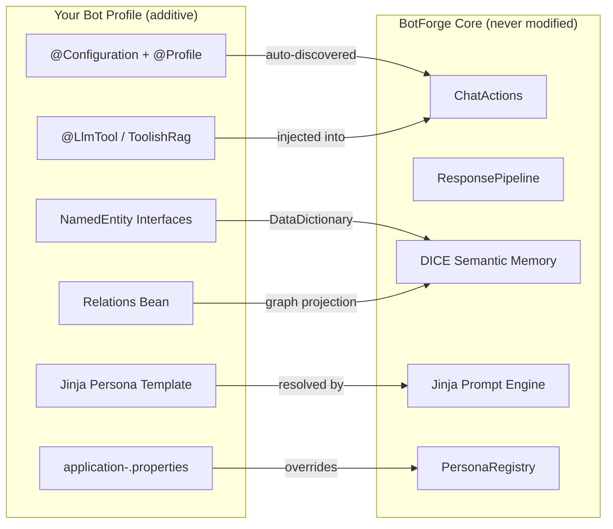
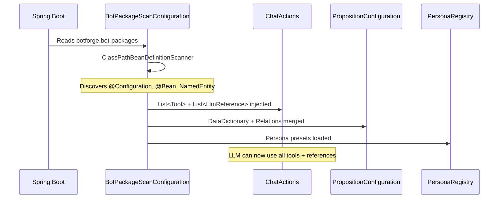

# Extending BotForge with Custom Bot Profiles

BotForge is designed for **extension without modification**. You build new bots by adding your own Spring profile — a package with a persona, domain model, tools, and styling — without touching any core code.

---

## Architecture



## Quick Start — Build a Bot in 5 Steps

### 1. Create the Package

```
src/main/java/org/legendstack/bot/<yourbot>/
    YourBotConfiguration.java
    domain/
        Customer.java       # NamedEntity interface
        Product.java        # NamedEntity interface
```

### 2. Write the Configuration

```java
package org.legendstack.bot.yourbot;

import com.embabel.dice.common.Relations;
import org.springframework.context.annotation.Bean;
import org.springframework.context.annotation.Configuration;
import org.springframework.context.annotation.Profile;

@Configuration
@Profile("yourbot")
public class YourBotConfiguration {

    @Bean
    public Relations yourBotRelations() {
        return Relations.empty()
                .withSemanticBetween("Customer", "Product", "purchased",
                        "customer purchased a product")
                .withSemanticBetween("Customer", "Customer", "referred",
                        "customer referred another customer");
    }
}
```

### 3. Define Domain Entities

Domain entities are Java **interfaces** extending `NamedEntity`. DICE generates JSON Schema from these to guide LLM extraction.

```java
package org.legendstack.bot.yourbot.domain;

import com.fasterxml.jackson.annotation.JsonPropertyDescription;
import com.embabel.dice.agent.NamedEntity;

public interface Customer extends NamedEntity {
    @JsonPropertyDescription("Customer tier: bronze, silver, gold, platinum")
    String getTier();
}

public interface Product extends NamedEntity {
    @JsonPropertyDescription("Product category, e.g. 'electronics', 'apparel'")
    String getCategory();
    @JsonPropertyDescription("Price in USD")
    Double getPrice();
}
```

### 4. Add Properties and Templates

**`application-yourbot.properties`:**
```properties
botforge.bot-packages=org.legendstack.bot.yourbot
botforge.persona=yourbot
botforge.objective=yourbot
botforge.max-words=100
botforge.chat-llm.temperature=0.2
```

**`prompts/personas/yourbot.jinja`:**
```jinja
You are a customer success specialist with deep product knowledge.
You speak clearly, reference product details, and proactively suggest solutions.


```

**`prompts/objectives/yourbot.jinja`:**
```jinja
Help users with product inquiries, order troubleshooting, and recommendations.
Draw on conversation history and the knowledge graph to provide personalized assistance.
```

### 5. Run

```bash
mvn spring-boot:run -Dspring-boot.run.profiles=yourbot
```

---

## Extension Axes — Deep Dive

### Properties

Create `application-<profile>.properties` to override any `botforge.*` property. Spring Boot merges these on top of `application.yml` — profile values always win.

| Property | Description | Default |
|----------|-------------|---------|
| `botforge.persona` | Persona template name → `prompts/personas/<name>.jinja` | `assistant` |
| `botforge.objective` | Objective template → `prompts/objectives/<name>.jinja` | `qa` |
| `botforge.behaviour` | Behaviour template → `prompts/behaviours/<name>.jinja` | `default` |
| `botforge.max-words` | Soft word limit for responses | `80` |
| `botforge.chat-llm.model` | LLM model ID | `gpt-4.1-mini` |
| `botforge.chat-llm.temperature` | LLM temperature | `0.0` |
| `botforge.memory.enabled` | Enable DICE memory extraction | `true` |
| `botforge.bot-packages` | Packages to scan for bot components | _(none)_ |

### Jinja Templates

Templates define three aspects of your bot's behavior:

| Template | Purpose | Context Variables |
|----------|---------|-------------------|
| `personas/<name>.jinja` | **Voice** — personality, tone, style | `properties`, `user` |
| `objectives/<name>.jinja` | **Goals** — what the bot should accomplish | `properties`, `user` |
| `behaviours/<name>.jinja` | **Rules** — behavioral constraints | `properties`, `user` |

Templates can include shared elements:
```jinja
     {# Inject DICE memory instructions #}
      {# Safety guidelines #}
```

### Domain Model (NamedEntity)

> **This is the most powerful extension axis.** Without domain entities, DICE extracts only untyped propositions. With them, it resolves mentions to typed entities and creates graph relationships.

When the user says _"We're migrating from MongoDB to PostgreSQL"_, DICE:
1. Extracts the proposition
2. Resolves "MongoDB" and "PostgreSQL" to `DataStore` entities (because the interface exists)
3. Creates `(System)-[:READS_FROM]->(DataStore {name: "PostgreSQL"})` (because Relations defines it)

**Interfaces only** — no classes needed. Neo4j nodes are hydrated via dynamic proxies.

### Relations

A `Relations` bean defines how entities connect in the knowledge graph. All `Relations` beans are auto-composed via `@Primary` composite in `PropositionConfiguration`.

```java
@Bean
Relations architecturalRelations() {
    return Relations.empty()
            .withSemanticBetween("SystemComponent", "DataStore", "reads_from",
                    "component reads from a data store")
            .withSemanticBetween("SystemComponent", "ApiEndpoint", "exposes",
                    "component exposes an API endpoint")
            .withSemanticBetween("AIAgent", "LLMModel", "calls_model",
                    "agent calls a specific LLM model");
}
```

### Tools and References

Any `Tool`, `LlmReference`, `ToolishRag`, or `Subagent` bean in your `@Configuration` is automatically injected into `ChatActions` via Spring's `List<Tool>` and `List<LlmReference>` collection injection.

```java
// Custom LLM-callable tool
@Bean
public DesignDocumentationTool architectureTools(BotForgeUserService userService) {
    return new DesignDocumentationTool(userService);
}

// Profile-scoped document search
@Bean
LlmReference scopedDocuments(SearchOperations searchOperations) {
    return new ToolishRag("scoped_docs", "Domain-specific documents", searchOperations)
            .withMetadataFilter(new PropertyFilter.Eq("context", "global"))
            .withUnfolding();
}
```

---

## Real Example: The Architect Bot

The `architect` profile ships with BotForge as a reference implementation:

```
org.legendstack.bot.architect/
├── ArchitectConfiguration.java          # Relations + DesignDocumentationTool
└── domain/
    ├── SystemComponent.java             # Microservices, modules, packages
    ├── ApiEndpoint.java                 # REST endpoints, GraphQL, gRPC
    ├── DataStore.java                   # Databases, caches, message queues
    ├── AIAgent.java                     # LLM-powered agents
    ├── LLMModel.java                    # Specific LLM models used
    └── DeploymentTarget.java            # Cloud, on-prem, edge targets
```

The architect persona template (`prompts/personas/architect.jinja`) defines a **collaborative mentor** that:
- Asks clarifying questions before proposing designs
- Provides "Good, Better, Best" options with trade-offs
- Generates ADRs via the `publish_design_doc` tool
- Guides developers toward existing enterprise services

---

## How Auto-Discovery Works



**Key insight:** You don't wire anything manually. Spring's `List<T>` injection and `@Primary` composite pattern mean that any bean you define is automatically available to the entire agent pipeline.
