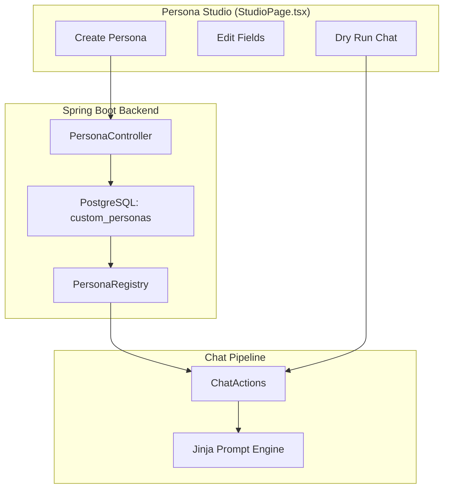
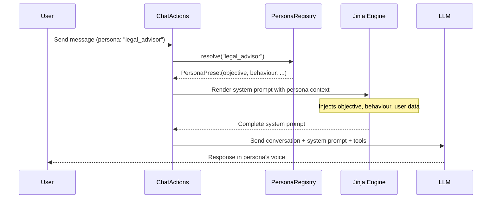
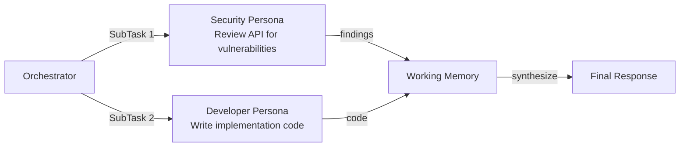

# Persona Studio

The **Persona Studio** lets users forge, edit, test, and deploy custom AI identities — entirely from the browser, without writing any code or restarting the server.

---

## Overview

BotForge ships with **5 built-in personas** that cover common use cases. The Persona Studio extends this with user-created personas that are persisted in PostgreSQL and instantly available in chat.

### Built-in Presets

| Persona | Icon | Description |
|---------|------|-------------|
| **Assistant** | ✨ | Thoughtful, precise knowledge assistant |
| **Security** | 🛡️ | Deep code audits and compliance checks |
| **Developer** | ⚡ | Fast reasoning optimized for coding tasks |
| **Architect** | 📐 | High-level system design, data strategy, and technical governance |
| **Orchestrator** | 🌐 | Intelligent router that delegates to specialized identities |

---

## How It Works



### Architecture

1. **PersonaRegistry** — Single source of truth for persona lookup. Checks built-in presets first, then user-created custom personas. Provides `resolve(personaId)`, `allForUser(userId)`, `saveCustom()`, `deleteCustom()`.

2. **CustomPersona** — JPA entity persisted in `custom_personas` table. Fields:
   - `id` — Unique identifier (auto-generated)
   - `userId` — Owner's user ID (personas are per-user)
   - `displayName` — Human-readable name shown in the UI
   - `objective` — What the persona should accomplish (up to 2000 chars)
   - `behaviour` — Behavioral constraints and rules
   - `description` — Short summary shown in persona picker
   - `icon` — Lucide icon name for the UI

3. **PersonaController** — REST API for CRUD operations and listing available personas

4. **StudioPage.tsx** — React frontend with persona creation form, editing, and inline "dry run" testing

---

## Creating a Custom Persona

### From the UI

1. Navigate to `/studio` (Persona Studio page)
2. Click **"Create New Persona"**
3. Fill in the fields:
   - **Display Name** — e.g., "Legal Advisor"
   - **Objective** — e.g., "Review contracts and highlight legal risks. Always cite relevant clauses."
   - **Behaviour** — e.g., "Be conservative. When unsure, recommend consulting a human attorney."
   - **Description** — e.g., "Contract review and legal risk analysis"
   - **Icon** — Choose from available Lucide icons (e.g., `scale`, `file-text`)
4. Click **Save**
5. The persona is immediately available in the chat sidebar's persona picker

### From the API

```bash
# Create
curl -X POST http://localhost:8080/api/personas \
  -H "Content-Type: application/json" \
  -d '{
    "displayName": "Legal Advisor",
    "objective": "Review contracts and highlight legal risks.",
    "behaviour": "Be conservative. Recommend human review for complex matters.",
    "description": "Contract review and legal risk analysis",
    "icon": "scale"
  }'

# List all (presets + custom)
curl http://localhost:8080/api/personas

# Delete
curl -X DELETE http://localhost:8080/api/personas/{id}
```

---

## How Personas Affect the Chat Pipeline

When a user selects a persona (or the Orchestrator selects one automatically), the system resolves it through `PersonaRegistry`:



### What Each Field Controls

| Field | Effect on LLM |
|-------|---------------|
| **Persona template** | Sets the bot's **voice** — personality, tone, style. Built-in personas use `.jinja` templates. Custom personas override via objective/behaviour fields. |
| **Objective** | Injected into the system prompt as the bot's **mission**. Tells the LLM _what_ to accomplish. |
| **Behaviour** | Injected as **rules and constraints**. Tells the LLM _how_ to behave. |
| **Display Name** | Shown in the UI persona picker and chat header. |

---

## The Orchestrator — Automatic Persona Selection

The **Orchestrator** is a special meta-persona that automatically delegates sub-tasks to the best-suited persona.

### How It Works

1. User sends a complex request to the Orchestrator persona
2. `OrchestratorService` asks the LLM to generate an `OrchestrationPlan` — a list of `SubTask` objects, each with a `personaId` and `objective`
3. Each sub-task is executed sequentially using the assigned persona's properties and templates
4. Results accumulate in `workingMemory`
5. A final synthesis step combines all sub-task outputs into a unified response

### Example Flow

**User:** _"Review this API design for security vulnerabilities and then write the implementation."_



The Orchestrator automatically resolves each persona ID to its properties, template, and LLM configuration, then runs the sub-task with the appropriate system prompt.

---

## Presets vs Custom Personas

| | **Presets** | **Custom Personas** |
|---|---|---|
| **Created by** | Developers (code) | End users (UI/API) |
| **Stored in** | `PersonaRegistry.PRESETS` (in-memory) | PostgreSQL `custom_personas` table |
| **Uses Jinja templates** | ✅ Full `.jinja` file per persona | ❌ Objective/behaviour injected inline |
| **Has domain model** | ✅ Via bot profile package | ❌ Uses base domain model |
| **Has custom tools** | ✅ Via `@Configuration` beans | ❌ Uses globally available tools |
| **Requires restart** | ✅ After code changes | ❌ Instant — just save |

**Key insight:** Preset personas (created via code profiles) are more powerful because they can define custom tools, domain entities, and Relations. Custom personas (created in Studio) are instant and no-code, but limited to prompt customization.

For maximum power, combine both: use a profile for tools/domain and a Studio persona for rapid iteration on the prompt.
